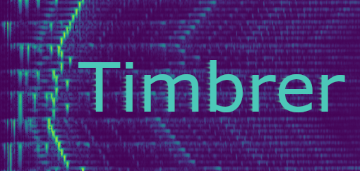

Timbrer: Musical Timbre Transfer
====================

## Audio samples
Timbre transfer samples can be found [here](https://harskish.github.io/Timbrer/index.html).

## Installation

1. Install anaconda/miniconda
2. Run in anaconda prompt: `conda env create -f environment.yml`
3. Activate new environment: `conda activate timbrer`

## Dataset generation
Run `generate_set_singlethread.py`. The input midi files will be downloaded and a dataset of mel spectrogram pairs will be created. Copy the resulting files from `data/spectrogram` to `pix2pixHD/datasets/timbre`.

## Training the network
Modify `pix2pixHD/train.py` by setting the correct test and dataset names. Start the training process: `cd pix2pixHD/ && python train.py`. Intermediate results will be visible in the `pix2pixHD/checkpoints/<test_name>/web/`folder.

## Running inference
Modify `pix2pixHD/test.py` by setting the test and dataset names. Run the file, which will generate the output spectrograms into the `pix2pixHD/results/<test_name>` folder.

## Reconstructing the waveforms
Run `reconstruct.py` and give it a list of `.npy` spectrograms or directories containing spectrograms. Optimizes white noise using L-BFGS to produce the target spectrogram. Expect around ~2s/image on a modern GPU. The resulting waveforms will be placed in the same folder as the inputs.

## Copyright notice
This work is a derivative of [pix2pixHD](https://github.com/NVIDIA/pix2pixHD) by NVIDIA Corporation.
